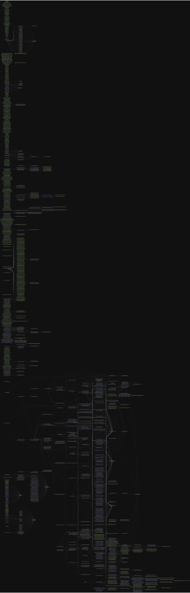
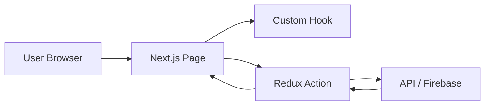

# 📐 Architecture Overview

## 🧭 Mục Tiêu
Tài liệu này cung cấp tổng quan kiến trúc hệ thống của dự án, mô tả các thành phần chính, cách chúng tương tác với nhau, và công nghệ được sử dụng. Mục tiêu là đảm bảo hiểu rõ cấu trúc, thuận tiện cho việc bảo trì và phát triển mở rộng sau này.

---

## 🧱 Tổng Quan Kiến Trúc

Sơ đồ kiến trúc tổng thể được minh họa như sau:

---

## 🧩 Thành Phần Chính

### 1. **Frontend** (Next.js + React)
- **Thư mục `pages/`** chứa các route chính: `_app.js`, `_document.js`, `index.js`, các route động như `[slug].js`, `auth/index.js`, v.v.
- **Chức năng**: render giao diện người dùng, routing, xử lý logic hiển thị.
- **Tech stack**: 
  - ReactJS
  - NextJS (SSG + SSR)
  - TailwindCSS / SASS
  - Axios (API calls)

### 2. **Custom Hooks**
- Nằm trong `src/customHook.js`
- Các hook tiêu biểu:
  - `useViewport`, `useOnClickOutside`, `useCountdown`, `useFormInput`, v.v.
- **Mục đích**: tái sử dụng logic UI nâng cao khả năng modular hóa code.

### 3. **Firebase Service Layer**
- File: `firebase.js`
- Class: `FirebaseConfig`
  - Quản lý cấu hình Firebase
  - Cung cấp `getMessagingToken`, `onMessageListener`
- Sử dụng Firebase Messaging cho **push notification**.

### 4. **Redux-like Actions**
- Nằm trong `src/actions/`
- Mỗi module (app, artist, billing, etc.) có các `actionType.js` riêng biệt.
- Quản lý các trạng thái toàn cục như `setToken`, `getAboutUsConfig`, `getGeoCheck`, `createTransaction`, v.v.

### 5. **Routing Engine**
- Thư mục: `routing/`
- Gồm các file: `page.js`, `path.js`, `pattern.js`
- **Công dụng**: ánh xạ URL đến component cụ thể theo logic tùy biến riêng.

### 6. **Backend Static Server**
- Các file trong `server/` và `server-static/` như `cache.js`, `index.js`.
- **Mục đích**: hỗ trợ pre-render, caching, xử lý dữ liệu tĩnh không cần backend độc lập.

### 7. **Service Worker**
- Được khai báo tại:
  - `_next/serviceworker.js`
  - `public/serviceworker.js`
  - `firebase-messaging-sw.js`
- Dùng để hỗ trợ **offline**, **push notification**, **background sync**.

---

## 🔁 Luồng Dữ Liệu Chính

1. Người dùng truy cập → React Page được render
2. Hook xử lý logic UI → gọi các Redux Actions
3. Action gọi đến API hoặc Firebase
4. Dữ liệu trả về cập nhật lại trạng thái → component cập nhật

---

## 📦 Các Package & Công Nghệ Chính

| Thành phần       | Công nghệ           |
|------------------|---------------------|
| Frontend         | React, NextJS       |
| UI Styling       | TailwindCSS, SASS   |
| State Management | Redux-like Actions  |
| Messaging        | Firebase Cloud Messaging |
| Routing Engine   | Tùy biến nội bộ     |
| Hook             | Custom React Hooks  |
| API Call         | Axios               |
| Caching          | Static Server Logic |
| SEO              | Next Head + _document.js |
| Service Worker   | Firebase & Custom   |

---

## 🛡️ Bảo mật & Môi trường
- Sử dụng `.env` để quản lý biến môi trường Firebase, API Keys.
- Không push file `.env` lên version control.
- Xác thực và phân quyền người dùng thực hiện qua Firebase hoặc các lớp kiểm tra trạng thái đăng nhập.

---

## 🔮 Tiềm năng mở rộng
- Tích hợp thêm các microservice backend độc lập qua API Gateway.
- Hỗ trợ SSR + CSR linh hoạt theo từng page.
- Phân tách các module thành package nội bộ để dễ bảo trì.
